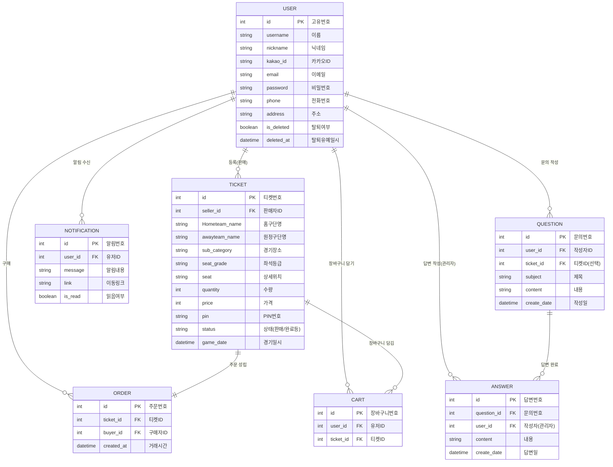

### 📊 우리 프로젝트 DB 설계도 (ERD)

```mermaid
erDiagram
    USER ||--o{ TICKET : "등록(판매)"
    USER ||--o{ ORDER : "구매"
    USER ||--o{ CART : "장바구니 담기"
    USER ||--o{ NOTIFICATION : "알림 수신"
    USER ||--o{ QUESTION : "문의 작성"
    USER ||--o{ ANSWER : "답변 작성(관리자)"
    TICKET ||--|| ORDER : "주문 성립"
    TICKET ||--o{ CART : "장바구니 담김"
    QUESTION ||--o{ ANSWER : "답변 완료"

    USER {
        int id PK "고유번호"
        string username "이름"
        string nickname "닉네임"
        string kakao_id "카카오ID"
        string email "이메일"
        string password "비밀번호"
        string phone "전화번호"
        string address "주소"
        boolean is_deleted "탈퇴여부"
        datetime deleted_at "탈퇴유예일시"
    }
    TICKET {
        int id PK "티켓번호"
        int seller_id FK "판매자ID"
        string Hometeam_name "홈구단명"
        string awayteam_name "원정구단명"
        string sub_category "경기장소"
        string seat_grade "좌석등급"
        string seat "상세위치"
        int quantity "수량"
        int price "가격"
        string pin "PIN번호"
        string status "상태(판매/완료등)"
        datetime game_date "경기일시"
    }
    ORDER {
        int id PK "주문번호"
        int ticket_id FK "티켓ID"
        int buyer_id FK "구매자ID"
        datetime created_at "거래시간"
    }
    CART {
        int id PK "장바구니번호"
        int user_id FK "유저ID"
        int ticket_id FK "티켓ID"
    }
    NOTIFICATION {
        int id PK "알림번호"
        int user_id FK "유저ID"
        string message "알림내용"
        string link "이동링크"
        boolean is_read "읽음여부"
    }
    QUESTION {
        int id PK "문의번호"
        int user_id FK "작성자ID"
        int ticket_id FK "티켓ID(선택)"
        string subject "제목"
        string content "내용"
        datetime create_date "작성일"
    }
    ANSWER {
        int id PK "답변번호"
        int question_id FK "문의번호"
        int user_id FK "작성자(관리자)"
        string content "내용"
        datetime create_date "답변일"
    }
```
