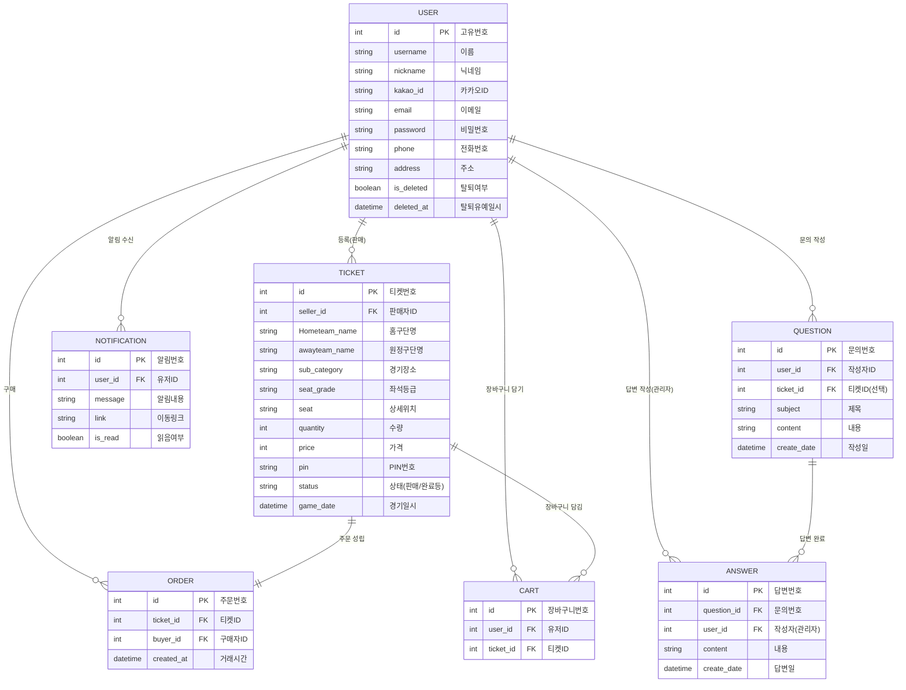

# KBO 야구 티켓 P2P 거래 플랫폼

야구팬들을 위한 안전하고 편리한 **KBO 티켓 중고 거래 웹 서비스**입니다.
토스 페이먼츠(Toss Payments) 연동을 통한 결제 기능, DB Lock을 활용한 동시성 제어, 그리고 스케줄러를 이용한 자동화 처리(기간 만료, 자동 구매확정 등)를 중점적으로 구현했습니다.

---

## 프로젝트 시연 및 주요 화면 (Screenshots & Demo)

_(💡 팁: 프로젝트 완성도를 시각적으로 보여줄 수 있는 시연 GIF나 캡처본을 GitHub에 업로드한 후 아래 이미지 링크를 교체하세요.)_

<div align="center">
  
  
</div>

<br>

<details>
<summary><b>✨ 주요 화면 스크린샷 펼쳐보기 (클릭)</b></summary>
<div markdown="1">

|                                   메인 화면                                    |                               티켓 검색 및 필터링                                |
| :----------------------------------------------------------------------------: | :------------------------------------------------------------------------------: |
|  |  |
|                          **안전 결제 (토스페이먼츠)**                          |                          **마이페이지 (알림/장바구니)**                          |
|    |      |

</div>
</details>

---

## 🛠 기술 스택 (Tech Stack)

### Backend

<p>
  
  
  
  
  
</p>

### Frontend

<p>
  
  
  
  
</p>

### External APIs & Services

<p>
  
  
</p>

---

## 💡 핵심 기능 및 기술적 주안점 (Key Features & Engineering)

### 1. 💳 안전한 결제 시스템 및 동시성 제어 (Concurrency Control)

- **Toss Payments API 연동**: 토스 페이먼츠 승인/취소 API를 완벽하게 연동하여 사용자 결제 경험을 향상시켰습니다.
- **동시 결제 방어 (DB Lock)**: 단일 중고 매물 특성상 여러 명이 동시에 결제를 시도할 수 있습니다. 결제 최종 승인 직전 `with_for_update()`를 통한 **비관적 락(Pessimistic Lock)**을 걸어 중복 결제를 방지했습니다.
- **자동 환불 시스템**: 찰나의 순간에 이미 판매된 티켓에 결제가 시도되거나 금액이 위변조된 경우, 예외 처리 후 토스 페이먼츠 **결제 취소 API를 호출해 즉시 자동 환불**되도록 시스템 안정성을 높였습니다.

### 2. ⏳ 스케줄러 기반의 비즈니스 로직 자동화

- **자동 구매 확정 로직**: 판매자가 정산을 받지 못하는 블랙컨슈머 상황을 방지하기 위해, 판매 완료 후 **7일이 지난 주문을 매일 새벽 1시에 자동으로 '거래완료' 상태로 변경**하고 알림을 전송합니다. (`@scheduler.task(cron)`)
- **기간 만료 티켓 처리**: 10분마다 실행되는 백그라운드 스케줄러가 경기 일시가 지난 방치된 티켓을 찾아 자동으로 **'기간만료' 처리**하여 사용자 검색 리스트의 품질을 유지합니다.

### 3. 🔐 카카오 소셜 로그인 & 스마트 계정 통합

- **OAuth 2.0 기반 카카오 로그인**: 카카오 인증 서버를 통한 간편 가입 및 로그인을 지원합니다.
- **계정 통합 로직**: 기존에 일반 이메일로 가입한 유저가 동일한 이메일의 카카오 계정으로 접근 시, 중복 가입 에러를 내뱉지 않고 **기존 계정에 카카오 ID를 매핑하여 자동으로 계정을 통합**하는 매끄러운 UX/UI를 구현했습니다.
- **Soft Delete 적용**: 회원 탈퇴 시 DB에서 즉시 삭제하지 않고 유예 기간(30일)을 두어, 실수로 탈퇴한 유저의 복구를 지원합니다.

### 4. 🔍 복합 검색 필터 & 세션 기반 편의 기능

- **다이내믹 필터링**: SQLAlchemy의 `filter`와 `or_` 구문을 조합하여 홈팀, 상대팀, 경기일시, 좌석 등급, 수량 등 복합적인 검색 기능을 최적화했습니다.
- **최근 본 상품**: Redis나 별도 DB 부하를 줄이기 위해 사용자의 브라우저 **Session을 활용하여 최근 본 티켓 내역을 관리**하고 Offcanvas UI로 편의성을 제공합니다.

---

## 📊 데이터베이스 모델링 (ERD)



(※ 위 핵심 구조 외에도 알림(`Notification`), 장바구니(`Cart`), 1:1 문의(`Question`, `Answer`) 등의 모델이 유기적으로 연결되어 있습니다.)

---

## 🚀 기타 주요 기능

- **실시간 알림 시스템**: 티켓 판매/구매, 문의 답변 작성 등 거래 상태 변경 시 사용자에게 알림을 제공하고 `읽음` 처리를 지원합니다.
- **장바구니 기능**: 여러 티켓을 모아 한 번에 결제할 수 있는 장바구니 기능을 지원하며, 결제 완료 및 삭제된 티켓은 장바구니에서 자동 정비됩니다.
- **관리자 페이지 & 1:1 문의**: 유저의 1:1 문의 작성 기능 및 관리자 권한(`@admin_required`)을 가진 유저의 답변 작성 기능을 지원합니다.
- **더미 데이터 제너레이터**: 테스트의 편의성을 위해 `seeddata.py`를 작성하여 10명의 유저, 300개의 KBO 티켓 매물, 100건의 주문 내역을 한 번에 생성 가능하게 구현했습니다.

---

## ⚙️ 로컬 실행 가이드 (How to run)

1. **저장소 클론 및 패키지 설치**

```bash
git clone <repository-url>
cd project2
pip install -r requirements.txt
```

2. **환경 변수 세팅 (config.py 또는 .env 설정 필요)**

- Kakao API `CLIENT_ID`, `CLIENT_SECRET`, `REDIRECT_URI`
- Toss Payments API `TOSS_SECRET_KEY`

3. **데이터베이스 세팅 및 시드 데이터 생성**

```bash
flask db upgrade
python seeddata.py
```

4. **애플리케이션 실행**

```bash
flask run
```
